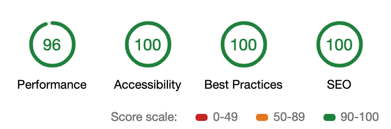

# danielburer.com

My personal website. Written as a React SPA that can be exported to a pseudo-static site.

Languages and frameworks used:
- [React](https://reactjs.org/)
- [Next.js](https://nextjs.org/)
- [Sass](https://sass-lang.com/)

See it live [here](https://danielburer.com/).

Currently chasing a perfect Lighthouse audit score for performance, accessibility, best practices, and SEO. Here are the numbers at present:

 

